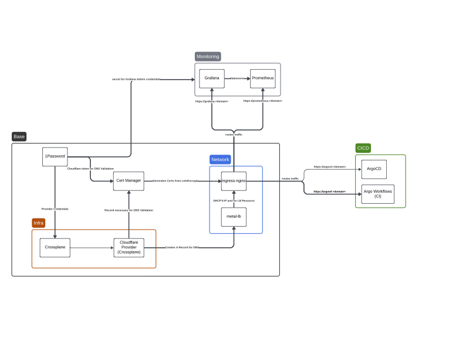

# Homelab-k8s

The following files are used to deploy resources onto my homelab kubernetes cluster. Mostly used as a lab for experimenting with new/interesting technology.

I'm trying to work out the directory structure a bit, so this is all likely to change frequently as I develop a framework.

## Design

The goal is to bootstrap the "base services" manually, plus ArgoCD, then configure everything within ArgoCD to be deployed and managed through CD.

There are two major components [base](./base) and [apps](./apps).

- base: these are the cluster level components required for operation and management.
- apps: this is essentially everything else. Base components support these.



## Structure

### Bootstrapping

Running [base/boopstrap.sh](./base/boostrap.sh) or [apps](./apps/bootstrap.sh) will execute all `install.sh` scripts within their respective directories.

These scripts are intended to be idemponent and only make changes when their target namespace does NOT exist.

```bash
# Expects the following:
# - Kube context @ desired cluster to bootstrap with appropriate access
# - kubectl, kustomize, kfilt, yq, installed and within PATH.
./bootstrap.sh
```

### Build

For more information about the container images in `build`, view [build/README.md](./build/README.md).

### Services

For more information about the `base` services installed, view [base/README.md](./base/README.md).
