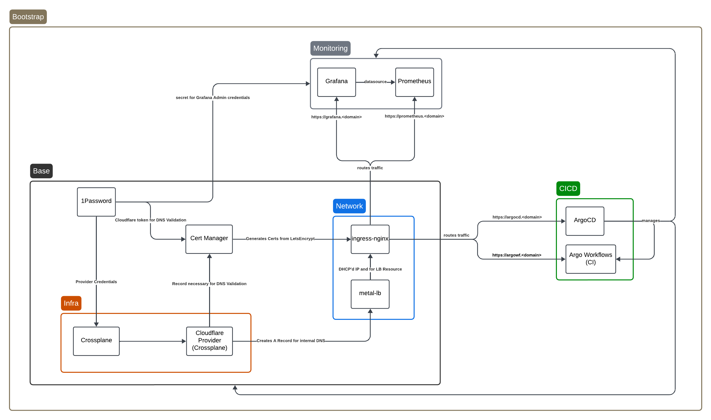

# Homelab-k8s

The following files are used to deploy resources onto my homelab kubernetes cluster. Mostly used as a lab for experimenting with new/interesting technology.

I'm trying to work out the directory structure a bit, so this is all likely to change frequently as I develop a framework.

# Design

The goal of this is to, given a configured kubernetes cluster, bootstrap all cluster wide applications through a simple bootstrap.sh script.

# Structure

Each of the following sub-sections is intended to represent a directory at the root of this repository.

## Automation

This contains code for automating my homelab kubernetes cluster. This is the first step of merging code in my private repo to live alongside this code.

## Build

This contains code to build various artifacts, typically containers.

For more information about the container images in `build`, view [build/README.md](./build/README.md).

## K8s

There are two major components [bootstrap](./k8s/bootstrap) and [apps](./k8s/apps).

- bootstrap: these are the cluster level components required for operation and management. Run once.
- apps: this is essentially everything else. Base components support these. Managed through ArgoCD.

> NOTE: Components in bootstrap are intended to be run once. Everything else, including additional manifests building upon bootstrapped components should live within apps and be managed by ArgoCD.



### Bootstrapping

Running [boopstrap.sh](./k8s/bootstrap/boostrap.sh) will simply recursively execute any `install.sh` executable scripts found within all child directories.

These scripts are intended to be idemponent and only make changes when their target namespace, or a custom written condition, does NOT exist.

```bash
# Expects the following:
# - Kube context @ desired cluster to bootstrap with appropriate access
# - kubectl, kustomize, kfilt, yq, installed and within PATH.
./bootstrap.sh
```

### Apps

These are applications intended to installed after bootstrap and managed through ArgoCD.
