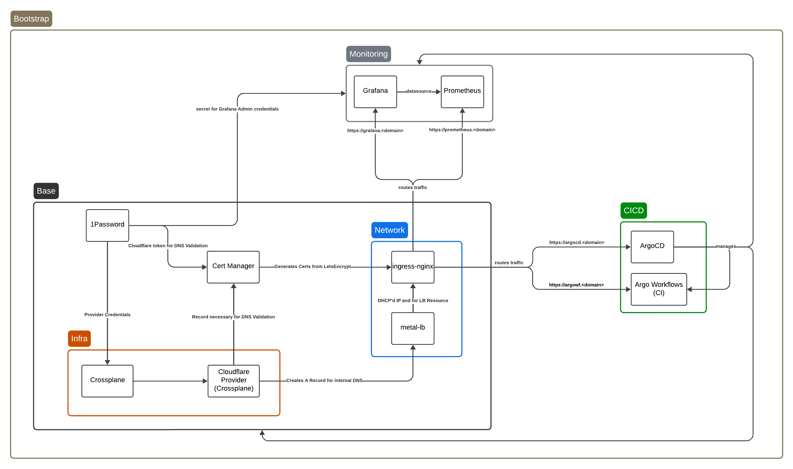

# Homelab-k8s

The following files are used to deploy resources onto my homelab kubernetes cluster. Mostly used as a lab for experimenting with new/interesting technology.

# Design

The goal of this is to, given a configured kubernetes cluster, bootstrap all cluster wide applications through a simple bootstrap.sh script.

**Key principle:** Bootstrap installs operators, CRDs, and Helm charts only. All application-level resources (routes, certificates, CRs) live in `k8s/namespaces/` and are managed by ArgoCD.

# Structure

Each of the following sub-sections is intended to represent a directory at the root of this repository.

## Build

This contains code to build various artifacts, typically containers.

For more information about the container images in `build`, view [build/README.md](./build/README.md).

## K8s

There are two major components: [bootstrap](./k8s/bootstrap) and [namespaces](./k8s/namespaces).

- **bootstrap**: cluster-level operators and controllers required for operation. Run once via `bootstrap.sh`. Installs Helm charts, CRDs, and operator deployments only.
- **namespaces**: everything else. Application configs, routes, certificates, dashboards — all managed through ArgoCD via a Git directory generator ApplicationSet.

> NOTE: Components in bootstrap are intended to be run once. Everything else, including additional manifests building upon bootstrapped components, should live within `k8s/namespaces/` and be managed by ArgoCD.



### Bootstrapping

Running [bootstrap.sh](./k8s/bootstrap/bootstrap.sh) will execute `install.sh` scripts in order across all bootstrap component directories.

These scripts are intended to be idempotent and only make changes when their target namespace, or a custom written condition, does NOT exist.

```bash
# Expects the following:
# - Kube context @ desired cluster to bootstrap with appropriate access
# - kubectl, kustomize, kfilt, yq, helm, jsonnet, jb installed and within PATH.
./bootstrap.sh
```

### Namespaces (ArgoCD-managed)

After bootstrap, ArgoCD discovers and syncs all directories under `k8s/namespaces/` automatically. To add a new application, create a directory with a `kustomization.yaml` under `k8s/namespaces/<name>/` and push to `main`.
