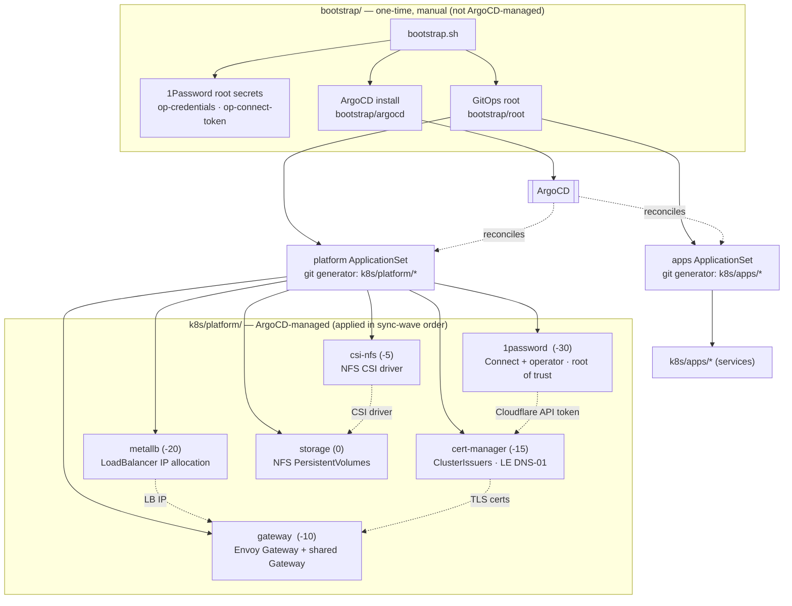

# Homelab-k8s

Homelab Kubernetes configuration for a Talos Linux cluster, managed with a GitOps approach using ArgoCD. A single `bootstrap.sh` script installs ArgoCD and the root-of-trust secrets; ArgoCD then converges every other component from this repo automatically.

## Architecture

The repo is split into a **one-time bootstrap** and **GitOps-managed** resources:

1. `bootstrap/bootstrap.sh` creates the 1Password root secrets, installs ArgoCD, and applies two ApplicationSets.
2. ArgoCD discovers `k8s/platform/*` (infrastructure, ordered by sync-wave) and `k8s/apps/*` (services) via git directory generators, creating one Application per directory.


```mermaid
flowchart TD
    %% Bootstrap — one-time, manual (NOT ArgoCD-managed)
    subgraph bootstrap["bootstrap/ — one-time, manual (not ArgoCD-managed)"]
        sh["bootstrap.sh"]
        op_root["1Password root secrets<br/>op-credentials · op-connect-token"]
        argocd_install["ArgoCD install<br/>bootstrap/argocd"]
        root["GitOps root<br/>bootstrap/root"]
        sh --> op_root & argocd_install & root
    end

    argocd_install --> argocd[["ArgoCD"]]
    root --> platformset["platform ApplicationSet<br/>git generator: k8s/platform/*"]
    root --> appsset["apps ApplicationSet<br/>git generator: k8s/apps/*"]
    argocd -.->|reconciles| platformset
    argocd -.->|reconciles| appsset

    %% Platform — ArgoCD-managed, sync-wave ordered
    subgraph platform["k8s/platform/ — ArgoCD-managed (applied in sync-wave order)"]
        direction TB
        p1["1password  (-30)<br/>Connect + operator · root of trust"]
        p2["metallb  (-20)<br/>LoadBalancer IP allocation"]
        p3["cert-manager  (-15)<br/>ClusterIssuers · LE DNS-01"]
        p4["gateway  (-10)<br/>Envoy Gateway + shared Gateway"]
        p6["csi-nfs  (-5)<br/>NFS CSI driver"]
        p7["storage  (0)<br/>NFS PersistentVolumes"]
    end

    platformset --> p1 & p2 & p3 & p4 & p6 & p7
    appsset --> apps["k8s/apps/* (services)"]

    %% Cross-dependencies (what consumes what)
    p1 -.->|Cloudflare API token| p3
    p2 -.->|LB IP| p4
    p3 -.->|TLS certs| p4
    p6 -.->|CSI driver| p7
```

For how requests reach services (public Cloudflare Tunnel and internal LAN paths), see [Ingress Traffic Flow](./docs/ingress-traffic-flow.md).

```
bootstrap/                          # one-time, manual (NOT ArgoCD-managed)
  bootstrap.sh                      # single idempotent entrypoint
  argocd/                           # kustomize: argo-cd helmChart + namespace + argocd-cm
  root/                             # platform + apps ApplicationSets + cronhealth app

k8s/
  platform/                         # ArgoCD-managed infrastructure (sync-wave ordered)
    1password/                      #   wave -30  Connect + operator
    metallb/                        #   wave -20  load balancer
    cert-manager/                   #   wave -15  TLS certificates
    gateway/                        #   wave -10  Envoy Gateway + Gateway + certs + redirect
    csi-nfs/                        #   wave  -5  CSI NFS driver
    storage/                        #   wave   0  cluster-scoped NFS PVs
  apps/                             # ArgoCD-managed services (wave >= 0)
    argocd/                         #   ArgoCD user config, RBAC, HTTPRoute
    backup-documents/               #   Kopia backup (UNAS documents)
    beszel/                         #   Beszel monitoring (dashboard.colinbruner.com)
    cloudflared/                    #   Cloudflare Tunnel connector
    sftp/                           #   SFTP server
packages/helm/                      # local Helm charts
  kopia/                            #   parameterized Kopia backup chart
  postgres/                         #   single-instance PostgreSQL StatefulSet
```

### Platform ordering (sync-waves)

| Wave | Component    | Purpose                               |
|------|------------- |---------------------------------------|
| -30  | 1password    | Secret operator (root-of-trust)       |
| -20  | metallb      | Load balancer IP allocation           |
| -15  | cert-manager | TLS certificate management            |
| -10  | gateway      | Envoy Gateway, Gateway, certificates  |
|  -5  | csi-nfs      | CSI NFS driver                        |
|   0  | storage      | Cluster-scoped NFS PersistentVolumes  |

Apps sync at wave >= 0 after all platform components.

### Monitoring

Lightweight monitoring is provided by [Beszel](./k8s/apps/beszel/README.md), exposed at `dashboard.colinbruner.com`. The cluster does not currently run a Prometheus/Grafana stack.

## Bootstrapping

Prerequisites:
- Kube-context pointed at the target cluster with admin access
- `kubectl`, `kustomize`, `helm` in PATH
- 1Password CLI (`op`) signed in to the `homelab` account

```bash
./bootstrap/bootstrap.sh
```

The script performs three idempotent steps:
1. Creates the 1Password root secrets (`op-credentials`, `op-connect-token`) via the `op` CLI
2. Installs ArgoCD: `kustomize build --enable-helm bootstrap/argocd | kubectl apply --server-side`
3. Applies the GitOps root: `kubectl apply -k bootstrap/root` (platform + apps ApplicationSets)

See [bootstrap/README.md](./bootstrap/README.md) for details on the root-of-trust secrets and idempotency.

## Service Index

### Platform (`k8s/platform/`)

| Component    | Description                                          | README                                                    |
|------------- |------------------------------------------------------|-----------------------------------------------------------|
| 1password    | 1Password Connect + operator                         | [README](./k8s/platform/1password/README.md)              |
| metallb      | MetalLB load balancer                                | [README](./k8s/platform/metallb/README.md)                |
| cert-manager | cert-manager TLS controller + ClusterIssuers         | [README](./k8s/platform/cert-manager/README.md)           |
| gateway      | Envoy Gateway, shared Gateway, TLS certs, redirect   | [README](./k8s/platform/gateway/README.md)                |
| csi-nfs      | CSI NFS driver                                       | [README](./k8s/platform/csi-nfs/README.md)                |
| storage      | Cluster-scoped NFS PersistentVolumes                 | [README](./k8s/platform/storage/README.md)                |

### Apps (`k8s/apps/`)

| App              | Description                                      | README                                                      |
|------------------|--------------------------------------------------|-------------------------------------------------------------|
| argocd           | ArgoCD user config, RBAC, HTTPRoute              | [README](./k8s/apps/argocd/README.md)                      |
| backup-documents | Kopia backup for UNAS documents                  | [README](./k8s/apps/backup-documents/README.md)            |
| beszel           | Beszel monitoring agent (`dashboard.colinbruner.com`) | [README](./k8s/apps/beszel/README.md)                 |
| cloudflared      | Cloudflare Tunnel connector                      | [README](./k8s/apps/cloudflared/README.md)                 |
| sftp             | SFTP server                                      | [README](./k8s/apps/sftp/README.md)                        |

### Local Helm Charts (`packages/helm/`)

| Chart      | Description                                              | README                                                |
|------------|----------------------------------------------------------|-------------------------------------------------------|
| kopia      | Parameterized Kopia backup chart                         | [README](./packages/helm/kopia/README.md)             |
| postgres   | Single-instance PostgreSQL StatefulSet                   | -                                                     |

## Playbooks

### Expose a new service

To expose `foo.colinbruner.com` in namespace `foo`:

1. **Certificate** -- add `k8s/platform/gateway/certificates/foo.yaml` with both public and internal SANs (`foo.colinbruner.com` + `foo-internal.colinbruner.com`)
2. **Gateway listener** -- add a listener with `certificateRef` to `k8s/platform/gateway/gateway.yaml`
3. **Kustomization** -- add the cert file to `k8s/platform/gateway/kustomization.yaml`
4. **HTTPRoute** -- add `httproute.yaml` in `k8s/apps/foo/` with both hostnames
5. **Internal DNS** -- add a `foo-internal` A record (pointing at the MetalLB Gateway IP) to the Terraform Cloudflare config and apply it
6. **Public DNS** -- run `cloudflared tunnel route dns homelab foo.colinbruner.com`
7. **Push to git** -- ArgoCD syncs everything automatically

### Add a backup target

To add a new Kopia backup target (e.g. `backup-scans`):

1. Create `k8s/apps/backup-scans/kustomization.yaml`:
   ```yaml
   helmGlobals:
     chartHome: ../../../packages/helm
   helmCharts:
     - name: kopia
       releaseName: backup
       namespace: backup-scans
       valuesFile: kopia-values.yaml
   resources:
     - namespace.yaml
     - chronos.yaml
   ```
2. Create `k8s/apps/backup-scans/kopia-values.yaml` with target-specific values (source path, schedule, GCS bucket, Chronos config)
3. Create `k8s/apps/backup-scans/namespace.yaml` for the namespace
4. Create `k8s/apps/backup-scans/chronos.yaml` with a `OnePasswordItem` for the Chronos health-check token
5. Push to git -- the apps ApplicationSet discovers the new directory automatically

See [k8s/apps/backup-documents/](./k8s/apps/backup-documents/) for a working example.

### DNS management (Cloudflare)

Two types of DNS records:

**Internal A records** (Terraform-managed):
- `<name>-internal.colinbruner.com` points at the MetalLB Gateway IP (`192.168.10.240-242`)
- Managed via Terraform (outside this repo; not GitOps) — apply changes with the Terraform Cloudflare workflow

**Public CNAME records** (Cloudflare-managed):
- Point `<name>.colinbruner.com` to `<TUNNEL_ID>.cfargotunnel.com`
- Created via `cloudflared tunnel route dns` CLI or the Cloudflare dashboard
- Tunnel CNAME records are outside GitOps

IP pool: `192.168.10.240-245` (MetalLB):
- `.240-242` -- Shared Envoy Gateway (all HTTPS services, internal pool)
- `.243-245` -- External pool (direct LoadBalancer services, opt-in)

## CI

GitHub Actions (`.github/workflows/validate.yaml`) runs on PRs and pushes to `main`:
1. **kustomize build** -- renders every `k8s/platform/*`, `k8s/apps/*`, `bootstrap/argocd`, and `bootstrap/root` target with `--enable-helm`
2. **kubeconform** -- validates rendered output against Kubernetes and CRD schemas
3. **yamllint + shellcheck** -- lints YAML and shell scripts
4. **ArgoCD validation** -- validates `bootstrap/root` ApplicationSet/Application manifests

## NFS Storage Layout (UNAS)

- `unas-docs-ro` -- Read-only documents
- `unas-k8s-rw` -- K8s cluster data (read-write)
- `unas-scans-rw` -- Scanned documents
- `unas-uptime-rw` -- Uptime monitoring data

