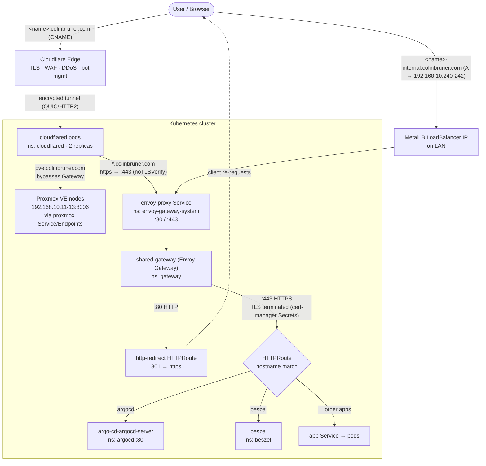

# Ingress Traffic Flow

How a request reaches a service in the cluster, for both **public** (internet) and
**internal** (LAN) access paths. Diagram reflects the manifests currently in this repo.

## Overview

There are two ways into the cluster and they share the same Envoy Gateway backend:

- **Public** — `<name>.colinbruner.com` resolves to a Cloudflare Tunnel CNAME. Traffic
  enters via Cloudflare's edge and the `cloudflared` pods; **no inbound ports are open** on
  the home network.
- **Internal** — `<name>-internal.colinbruner.com` resolves to a MetalLB IP
  (`192.168.10.240-242`) on the LAN, hitting the Envoy proxy `LoadBalancer` Service directly
  and **bypassing Cloudflare entirely**.

Both paths terminate TLS at the shared Gateway and are routed to apps by `HTTPRoute`s that
match on hostname. One exception: `pve.colinbruner.com` is routed by `cloudflared` straight
to the Proxmox hosts, never touching the Gateway.

## Path details

### Public (via Cloudflare Tunnel)

1. **DNS** — `<name>.colinbruner.com` is a **CNAME** to `<TUNNEL_ID>.cfargotunnel.com`.
   Only hostnames with such a CNAME ever reach the tunnel — this is the de-facto access
   control. CNAMEs are created out-of-band via `cloudflared tunnel route dns` (not GitOps).
2. **Cloudflare Edge** — terminates the public TLS connection and applies WAF / DDoS / bot
   protection, then forwards over the encrypted tunnel.
3. **`cloudflared` pods** (`ns: cloudflared`, 2 replicas) — connect outbound to Cloudflare;
   routing is defined in `resources/configmap.yaml`:
   - `pve.colinbruner.com` → Proxmox hosts directly (`proxmox` Service + Endpoints,
     `192.168.10.11-13:8006`), **bypassing the Gateway**.
   - `*.colinbruner.com` → `https://envoy-proxy.envoy-gateway-system.svc.cluster.local:443`
     with `noTLSVerify` (the Gateway re-terminates TLS).
   - catch-all → `http_status:404`.

### Internal (direct LAN)

1. **DNS** — `<name>-internal.colinbruner.com` is an **A** record to a MetalLB IP
   (`192.168.10.240-242`), managed via Crossplane in `k8s/platform/crossplane/`.
2. **MetalLB** advertises the `LoadBalancer` IP for the `envoy-proxy` Service on the LAN.
   Traffic goes straight to Envoy — no Cloudflare involved.

### Shared backend (Envoy Gateway)

- **`envoy-proxy` Service** (`ns: envoy-gateway-system`) — the data-plane LoadBalancer.
  Its name is pinned via the `EnvoyProxy` `proxy-config` so cluster consumers (cloudflared)
  have a stable DNS name.
- **`shared-gateway`** (`ns: gateway`) — one Gateway with two listeners:
  - **`:80` HTTP** → `http-redirect` HTTPRoute issues a `301` to `https`.
  - **`:443` HTTPS** → terminates TLS using per-domain Secrets
    (`argocd-tls`, `grafana-tls`, `prometheus-tls`, `uptime-tls`, `n8n-tls`, `garage-tls`,
    `dashboard-tls`) issued by cert-manager via the Let's Encrypt DNS-01 challenge.
- **`HTTPRoute`s** live in each app's directory (e.g. `k8s/apps/argocd/`) and attach to the
  Gateway's `https` listener via `parentRefs`. They match on hostname (both the public and
  `-internal` names) and forward to the app's Service.

## Notes

- The `cloudflared` app README describes an **Authentik `ext_authz` / `SecurityPolicy`**
  authentication layer at the Gateway. That is **not present in the current manifests** —
  no `SecurityPolicy` or Authentik resources exist in the repo. The diagram above shows the
  flow as actually deployed. Treat the Authentik section of that README as a planned design.
- Some HTTPS listener certificate refs (grafana, prometheus, n8n, garage, dashboard) exist
  on the Gateway without a corresponding app in `k8s/apps/`, anticipating future services.
